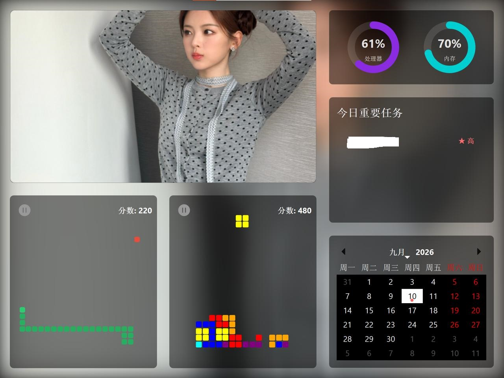

# ScreenGallery



A modern, Metro-style Smart Digital Photo Frame application. Built with Python and PyQt6.

[中文文档说明请向下滚动 | Scroll down for Chinese documentation]

## Features
- **Dynamic Media Gallery**: Automatically shuffles and displays images and silent MP4 videos from your chosen folder with a frosted glass backdrop effect. Features a hardware-accelerated smooth auto-scrolling engine for vertical portrait photos.
- **System Dashboard**: Real-time CPU and RAM monitoring gauges.
- **Priority Tasks (Memos)**: A smart daily checklist. Long-press (800ms) on any task to complete or uncomplete it.
- **Interactive Calendar**: Highlights dates that have pending tasks.
- **Auto-playing AI Mini-Games**: Built-in auto-playing Snake and Tetris games that run autonomously on the dashboard to keep the screen dynamic and alive.
- **Fully Responsive**: The UI ratio automatically adapts its elements seamlessly to fit both 4:3 and 16:9 screens without overflow clipping.
- **Multilingual Support**: The application automatically detects the system language and supports English and Chinese.

## Environment Setup

To run or build this project, you need Python 3.10+ installed on Windows.

1. **Clone the repository and navigate into the folder:**
   ```cmd
   cd ScreenGallery
   ```

2. **Create and activate a virtual environment (Recommended):**
   ```cmd
   python -m venv .venv
   .venv\Scripts\activate
   ```

3. **Install the required dependencies:**
   ```cmd
   pip install PyQt6 psutil pyinstaller
   ```

## Running the Application Locally

You can launch the application directly from the source code. Press the **Esc** key at any time to exit the full-screen app.

```cmd
python main.py
```

## Packaging into a Standalone `.exe`

We use PyInstaller to compile the entire application into a highly compressed, single-file `.exe`. All assets (QSS styles, SVG icons, algorithms) are perfectly embedded inside.

A custom build script `build.py` handles the compilation parameters:

```cmd
python build.py
```

Once the build process completes, the final standalone executable will be located at:
`dist/ScreenGallery.exe`

You can move this single file to any Windows machine, double click it, and use it directly without needing to install Python or any dependencies!

---

# ScreenGallery (中文)


这是一个现代化 Metro 风格智能数码相框应用程序。使用 Python 和 PyQt6 构建。

## 特色功能
- **动态相册展板**：带毛玻璃背景效果的本地相册，自动轮播您选中目录内的图片与 MP4 纯净静音视频。内置硬件加速级别的自绘平滑滚动引擎，针对竖向长图提供如丝般顺滑的自动下卷展示体验。
- **系统状态监控**：实时展示当前电脑的 CPU 与内存占用情况。
- **今日高优先级任务（备忘录）**：极简的待办事项检查单，支持触屏长按操作（长按 0.8 秒即可完成或取消任务）。
- **交互式日历**：底部红点清晰指示包含待办任务的日期。
- **AI 全自动迷你游戏**：在底部的仪表盘中内置了 AI 全自动演算的贪吃蛇和俄罗斯方块游戏，让整个屏幕随时保持活力。
- **自适应响应式布局**：经过完美调校的内部自适应拉伸算法，兼容从 16:9 宽屏到 4:3 老旧显示器，画面均不会出现超出屏幕的裁剪现象。
- **多语言支持**：程序会自动识别您操作系统的语言配置，自动切换为中文或英文。

## 环境配置

如需运行或打包此项目，您的 Windows 设备上需要安装 Python 3.10 或更高版本。

1. **克隆项目并进入文件夹：**
   ```cmd
   cd ScreenGallery
   ```

2. **创建并激活虚拟环境（推荐）：**
   ```cmd
   python -m venv .venv
   .venv\Scripts\activate
   ```

3. **安装必须的依赖：**
   ```cmd
   pip install PyQt6 psutil pyinstaller
   ```

## 在本地运行

您可以通过源码直接拉起本程序进行调试或使用。在全屏状态下，随时按下键盘上的 **Esc** 键即可退出程序。

```cmd
python main.py
```

## 打包为单文件便携版（.exe）

本项目使用 PyInstaller 编译为高压缩率的独立单文件 `.exe`。应用运行所需的所有资源（包括 QSS 样式表、自绘矢量 SVG 图标等）都会被深度内嵌其中。

我们提供了定制的构建脚本 `build.py`，您可以直接运行：

```cmd
python build.py
```

编译完成后，您可以在以下目录找到生成的可执行文件成品：
`dist/ScreenGallery.exe`

直接将这个文件拷贝到任何其他的 Windows 电脑上双击即可立刻享受，无需再安装 Python 环境！
